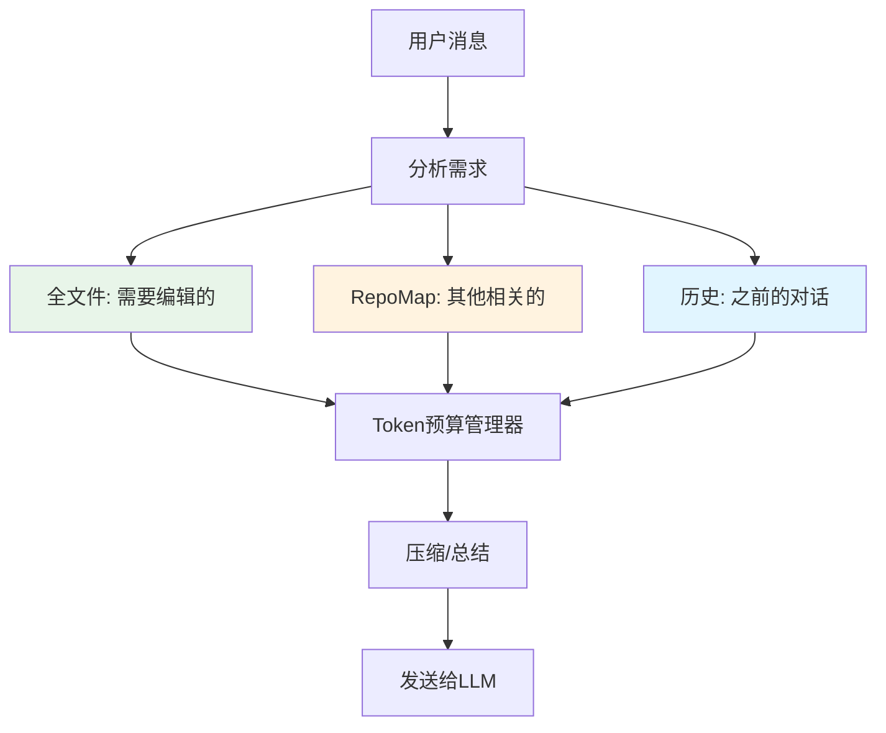

# Aider 的 Context Engineering 详解

> 如何在有限的上下文窗口中，给 LLM 提供最有价值的代码信息？

## 目录

1. [什么是 Context Engineering？](#什么是-context-engineering)
2. [核心挑战](#核心挑战)
3. [Aider 的解决方案](#aider-的解决方案)
4. [Context 的组成部分](#context-的组成部分)
5. [RepoMap：智能代码映射](#repomap智能代码映射)
6. [Token 预算管理](#token-预算管理)
7. [上下文优先级](#上下文优先级)
8. [缓存策略](#缓存策略)
9. [实际代码流程](#实际代码流程)
10. [最佳实践](#最佳实践)

---

## 什么是 Context Engineering？

**Context Engineering（上下文工程）** 是指精心设计和管理发送给 LLM 的上下文信息，以在有限的 token 预算内最大化效果。

### 类比理解

想象你要向一位专家咨询代码问题：

```
❌ 错误方式：把整个项目（10万行代码）都给他看
   - 专家会被海量信息淹没
   - 无法关注重点
   - 浪费时间阅读无关代码

✅ Aider 的方式：
   1. 只给他需要编辑的文件（全文）
   2. 其他相关文件的"目录"（函数、类定义列表）
   3. 聊天历史的摘要
   4. 系统指令
```

---

## 核心挑战

### 挑战 1：上下文窗口限制

```python
# 典型的 LLM 限制
models = {
    "gpt-4": {
        "max_input_tokens": 128_000,    # 128k tokens
        "max_output_tokens": 4_096      # 4k tokens
    },
    "claude-3.5-sonnet": {
        "max_input_tokens": 200_000,    # 200k tokens
        "max_output_tokens": 8_192      # 8k tokens
    },
    "deepseek-chat": {
        "max_input_tokens": 64_000,     # 64k tokens
        "max_output_tokens": 8_192      # 8k tokens
    }
}

# 代码库通常很大
typical_codebase = {
    "total_files": 500,
    "total_lines": 50_000,
    "estimated_tokens": 200_000  # 远超上下文窗口！
}
```

### 挑战 2：相关性问题

不是所有代码都对当前任务相关：

```python
# 用户任务：修复登录功能的 bug

relevant_files = [
    "auth/login.py",           # ✅ 高度相关
    "auth/session.py",         # ✅ 相关
    "database/users.py",       # ✅ 可能相关
]

irrelevant_files = [
    "static/css/style.css",    # ❌ 不相关
    "tests/test_payment.py",   # ❌ 不相关
    "docs/README.md",          # ❌ 不相关
    # ... 还有 495 个文件
]
```

### 挑战 3：成本问题

```python
# Token 成本（以 GPT-4 为例）
cost_per_1k_input_tokens = 0.01   # $0.01 / 1k tokens
cost_per_1k_output_tokens = 0.03  # $0.03 / 1k tokens

# 发送整个代码库的成本
full_codebase_tokens = 200_000
cost = full_codebase_tokens / 1000 * 0.01
# = $2.00 每次请求！

# 如果每天交互 50 次 = $100/天
```

---

## Aider 的解决方案

Aider 使用**分层上下文策略** + **智能代码映射** + **动态 Token 预算**。

### 核心思想



### 三大支柱

1. **完整上下文**（Files in Chat）：需要编辑的文件
2. **RepoMap**（智能映射）：其他相关代码的概览
3. **Chat History**（对话历史）：之前的交互

---

## Context 的组成部分

### Context 结构

从 `base_coder.py:format_chat_chunks()` 可以看到完整结构：

```python
def format_chat_chunks(self):
    chunks = ChatChunks()

    # 1. 系统提示词 (System Prompt)
    chunks.system = [
        {"role": "system", "content": main_system_prompt}
    ]

    # 2. 示例对话 (Few-shot Examples)
    chunks.examples = example_messages

    # 3. 历史对话 (Done Messages)
    chunks.done = self.done_messages  # 已完成的对话

    # 4. RepoMap (代码库映射)
    chunks.repo = self.get_repo_messages()

    # 5. 只读文件 (Read-only Files)
    chunks.readonly_files = self.get_readonly_files_messages()

    # 6. 聊天文件 (Chat Files) - 可编辑
    chunks.chat_files = self.get_chat_files_messages()

    # 7. 当前消息 (Current Messages)
    chunks.cur = self.cur_messages

    # 8. 提醒消息 (Reminder)
    chunks.reminder = reminder_message  # 格式规则提醒

    return chunks
```

### 实际发送顺序

```python
# chunks.all_messages() 的顺序：
messages = [
    # 1. System (系统提示词)
    {"role": "system", "content": "Act as an expert software developer..."},

    # 2. Examples (示例对话，教LLM如何回复)
    {"role": "user", "content": "Change get_factorial() to use math.factorial"},
    {"role": "assistant", "content": "SEARCH/REPLACE blocks..."},

    # 3. Done Messages (历史对话，可能被总结)
    {"role": "user", "content": "Add logging to user authentication"},
    {"role": "assistant", "content": "Applied edits..."},

    # 4. Repo Map (代码库映射)
    {"role": "user", "content": "Here are summaries of other files:\n\nauth/session.py:\nclass SessionManager:\n  def create_session(self, user_id)...\n"},
    {"role": "assistant", "content": "Ok, I won't try and edit those files without asking first."},

    # 5. Read-only Files (只读文件，完整内容)
    {"role": "user", "content": "Here are read-only files:\n\nconfig.py:\n```python\nDATABASE_URL = 'postgresql://...'\n```"},
    {"role": "assistant", "content": "Ok, I will use these files as references."},

    # 6. Chat Files (聊天中的文件，完整内容)
    {"role": "user", "content": "Here are the files:\n\nauth/login.py:\n```python\ndef login(username, password):\n    ...\n```"},
    {"role": "assistant", "content": "Ok, I can edit those files for you."},

    # 7. Current Message (当前用户消息)
    {"role": "user", "content": "Fix the bug where login fails with special characters"},

    # 8. Reminder (可选，提醒格式规则)
    {"role": "system", "content": "Remember to use SEARCH/REPLACE blocks..."}
]
```

### Token 分配示例

假设 128k token 的上下文窗口：

```python
token_budget = {
    "total": 128_000,

    "system_prompt": 2_000,      # ~2%   - 系统提示词和示例
    "chat_history": 10_000,      # ~8%   - 对话历史（总结后）
    "repo_map": 20_000,          # ~15%  - 代码库映射 ⭐
    "readonly_files": 5_000,     # ~4%   - 只读文件
    "chat_files": 70_000,        # ~55%  - 可编辑文件 ⭐
    "current_message": 1_000,    # ~1%   - 当前消息
    "reminder": 500,             # ~0.4% - 提醒

    "reserved_output": 20_000,   # ~15%  - 留给模型输出
}

# 关键：chat_files 和 repo_map 占据了 70% 的上下文
```

---

## RepoMap：智能代码映射

### 什么是 RepoMap？

RepoMap 是 Aider 的核心创新，它为代码库生成一个**智能摘要**：

```python
# 不是这样（太简单）：
simple_map = """
Files in repo:
- auth/login.py
- auth/session.py
- database/users.py
...
"""

# 而是这样（智能的）：
repo_map = """
auth/session.py:
class SessionManager:
  def create_session(self, user_id, ip_address): ...
  def validate_session(self, session_id): ...
  def destroy_session(self, session_id): ...

database/users.py:
class UserModel:
  def get_user_by_username(self, username): ...
  def verify_password(self, user, password): ...

utils/crypto.py:
def hash_password(password, salt): ...
def generate_salt(): ...
"""
```

### RepoMap 的生成流程

#### 第 1 步：扫描和解析

```python
# repomap.py:get_tags()
def get_tags(self, fname, rel_fname):
    """使用 tree-sitter 提取代码定义"""

    # 1. 判断语言
    lang = filename_to_lang(fname)  # "python", "javascript", etc.

    # 2. 获取解析器
    parser = get_parser(lang)
    language = get_language(lang)

    # 3. 解析代码
    code = io.read_text(fname)
    tree = parser.parse(bytes(code, "utf-8"))

    # 4. 运行查询（提取定义和引用）
    query_scm = get_scm_fname(lang)  # 语言特定的查询
    query = language.query(query_scm)
    captures = query.captures(tree.root_node)

    # 5. 提取标签
    for node, tag in captures:
        if tag.startswith("name.definition."):
            # 这是一个定义（函数、类等）
            yield Tag(
                rel_fname=rel_fname,
                fname=fname,
                name=node.text.decode("utf-8"),
                kind="def",
                line=node.start_point[0]
            )
        elif tag.startswith("name.reference."):
            # 这是一个引用（调用、使用等）
            yield Tag(
                rel_fname=rel_fname,
                fname=fname,
                name=node.text.decode("utf-8"),
                kind="ref",
                line=-1  # 引用不需要行号
            )
```

**示例输出**：

```python
# 对于文件 auth/login.py:
tags = [
    Tag(rel_fname="auth/login.py", name="login", kind="def", line=10),
    Tag(rel_fname="auth/login.py", name="validate_credentials", kind="def", line=25),
    Tag(rel_fname="auth/login.py", name="SessionManager", kind="ref", line=-1),
    Tag(rel_fname="auth/login.py", name="UserModel", kind="ref", line=-1),
    Tag(rel_fname="auth/login.py", name="hash_password", kind="ref", line=-1),
]
```

#### 第 2 步：构建依赖图

```python
# repomap.py:get_ranked_tags()
def get_ranked_tags(self, chat_fnames, other_fnames, mentioned_fnames, mentioned_idents):
    """使用 PageRank 算法对代码定义排序"""

    import networkx as nx

    defines = defaultdict(set)      # 定义：标识符 -> 文件集合
    references = defaultdict(list)  # 引用：标识符 -> 文件列表

    # 1. 收集所有文件的标签
    for fname in all_fnames:
        tags = self.get_tags(fname, rel_fname)
        for tag in tags:
            if tag.kind == "def":
                defines[tag.name].add(rel_fname)
            elif tag.kind == "ref":
                references[tag.name].append(rel_fname)

    # 2. 构建有向图
    G = nx.MultiDiGraph()

    for ident in defines.keys():
        definers = defines[ident]      # 定义这个标识符的文件
        referencers = references[ident]  # 引用这个标识符的文件

        for referencer in referencers:
            for definer in definers:
                weight = 1.0

                # 权重调整策略
                if ident in mentioned_idents:
                    weight *= 10  # 用户提到的标识符

                if is_meaningful_name(ident):  # snake_case, 8+ 字符
                    weight *= 10

                if referencer in chat_fnames:
                    weight *= 50  # 聊天文件中的引用

                # 添加边：引用者 -> 定义者
                G.add_edge(referencer, definer, weight=weight, ident=ident)

    # 3. PageRank 算法
    personalization = {}
    for fname in chat_fnames:
        personalization[fname] = 100 / len(all_fnames)

    ranked = nx.pagerank(
        G,
        weight="weight",
        personalization=personalization  # 偏向聊天文件
    )

    # 4. 分配排名到具体定义
    ranked_definitions = defaultdict(float)
    for src in G.nodes:
        src_rank = ranked[src]
        total_weight = sum(data["weight"] for _, _, data in G.out_edges(src, data=True))

        for _, dst, data in G.out_edges(src, data=True):
            # 按权重分配排名
            ident = data["ident"]
            ranked_definitions[(dst, ident)] += src_rank * data["weight"] / total_weight

    # 5. 排序返回
    ranked_tags = sorted(
        ranked_definitions.items(),
        reverse=True,
        key=lambda x: (x[1], x[0])  # 按排名降序
    )

    return ranked_tags
```

**PageRank 的直觉理解**：

```
假设代码库：

File A (在聊天中):
  - 调用 foo()
  - 调用 bar()

File B:
  - 定义 foo()
  - 调用 baz()

File C:
  - 定义 bar()

File D:
  - 定义 baz()

PageRank 结果（重要性）：
1. File B (高) - A 调用了它的 foo()，且 A 在聊天中
2. File C (高) - A 调用了它的 bar()，且 A 在聊天中
3. File D (中) - 被 B 调用，但间接相关
```

#### 第 3 步：Token 预算裁剪

```python
# repomap.py:get_ranked_tags_map_uncached()
def get_ranked_tags_map_uncached(self, chat_fnames, other_fnames, max_map_tokens, ...):
    """二分搜索找到最佳的 RepoMap 大小"""

    # 1. 获取排序后的标签
    ranked_tags = self.get_ranked_tags(...)

    # 2. 二分搜索最佳数量
    num_tags = len(ranked_tags)
    lower_bound = 0
    upper_bound = num_tags
    best_tree = None
    best_tree_tokens = 0

    middle = min(int(max_map_tokens // 25), num_tags)  # 初始估计

    while lower_bound <= upper_bound:
        # 生成前 middle 个标签的树形视图
        tree = self.to_tree(ranked_tags[:middle], chat_rel_fnames)
        num_tokens = self.token_count(tree)

        # 检查是否在预算内
        pct_err = abs(num_tokens - max_map_tokens) / max_map_tokens

        if num_tokens <= max_map_tokens and num_tokens > best_tree_tokens:
            best_tree = tree
            best_tree_tokens = num_tokens

        if pct_err < 0.15:  # 在 15% 误差内，足够好
            break

        # 二分搜索
        if num_tokens < max_map_tokens:
            lower_bound = middle + 1
        else:
            upper_bound = middle - 1

        middle = (lower_bound + upper_bound) // 2

    return best_tree
```

**二分搜索的目标**：

```
目标：找到最多的标签数量，使得生成的树形视图刚好在 token 预算内

示例：
max_map_tokens = 2000

尝试 1: middle=100, tokens=2500 ❌ 太大
尝试 2: middle=50,  tokens=1200 ✅ 可以，但还有空间
尝试 3: middle=75,  tokens=1850 ✅ 接近！
尝试 4: middle=80,  tokens=1950 ✅ 完美！

最终：包含 80 个最相关的定义
```

#### 第 4 步：生成树形视图

```python
# repomap.py:to_tree()
def to_tree(self, tags, chat_rel_fnames):
    """将标签转换为树形文本视图"""

    output = ""

    # 按文件分组
    for tag in sorted(tags):
        fname = tag.rel_fname

        if fname in chat_rel_fnames:
            continue  # 跳过聊天文件（已有完整内容）

        # 文件头
        output += "\n" + fname + ":\n"

        # 使用 TreeContext 生成上下文
        if tag.kind == "def":
            # 显示定义的上下文（函数签名、类定义等）
            output += self.render_tree(fname, [tag.line])

    return output
```

**最终 RepoMap 输出示例**：

```
auth/session.py:
class SessionManager:
│   def __init__(self, db_connection):
│   def create_session(self, user_id, ip_address):
│   def validate_session(self, session_id):
│   def destroy_session(self, session_id):

database/users.py:
class UserModel:
│   def get_user_by_username(self, username):
│   def get_user_by_email(self, email):
│   def verify_password(self, user, password):
│   def update_last_login(self, user_id):

utils/crypto.py:
│ def hash_password(password, salt):
│ def generate_salt():
│ def constant_time_compare(a, b):
```

### RepoMap 的优势

```python
# 对比：

# 方式1：发送完整文件（太大）
full_files = """
auth/session.py (500 lines, 2000 tokens)
database/users.py (800 lines, 3500 tokens)
utils/crypto.py (200 lines, 800 tokens)
Total: 6300 tokens
"""

# 方式2：只发送文件名（太少）
file_list = """
auth/session.py
database/users.py
utils/crypto.py
Total: 20 tokens
"""

# 方式3：RepoMap（恰到好处！）
repo_map = """
auth/session.py:
  class SessionManager:
    def create_session(...)
    def validate_session(...)
    ...
Total: 300 tokens ✅
"""

# RepoMap 提供：
# ✅ 比完整文件少 20 倍 token
# ✅ 比文件名多 15 倍信息
# ✅ LLM 可以理解代码结构
# ✅ LLM 知道去哪里找相关代码
```

---

## Token 预算管理

### 动态预算分配

```python
# base_coder.py:format_chat_chunks()
def format_chat_chunks(self):
    chunks = ChatChunks()

    # ... 组装所有 chunks ...

    # 计算 token 使用
    messages_tokens = self.main_model.token_count(chunks.all_messages())
    reminder_tokens = self.main_model.token_count(reminder_message)
    cur_tokens = self.main_model.token_count(chunks.cur)

    total_tokens = messages_tokens + reminder_tokens + cur_tokens
    max_input_tokens = self.main_model.info.get("max_input_tokens") or 0

    # 检查是否超出预算
    if total_tokens >= max_input_tokens:
        # 触发压缩策略
        self.handle_token_overflow()

    return chunks
```

### RepoMap Token 自适应

```python
# repomap.py:get_repo_map()
def get_repo_map(self, chat_files, other_files, ...):
    max_map_tokens = self.max_map_tokens  # 默认 1024

    # 策略1：如果没有聊天文件，扩大 RepoMap
    if not chat_files:
        padding = 4096
        target = min(
            int(max_map_tokens * self.map_mul_no_files),  # 通常是 8x
            self.max_context_window - padding
        )
        if target > 0:
            max_map_tokens = target

    # 示例：
    # - 有文件在聊天：max_map_tokens = 1024
    # - 无文件在聊天：max_map_tokens = 8192 (8x)
    #   理由：需要更大的视野来理解整个代码库
```

### 聊天历史总结

```python
# history.py:ChatSummary
class ChatSummary:
    def summarize(self, messages):
        """当历史太长时，总结旧对话"""

        if not self.too_big(messages):
            return messages  # 还不需要总结

        # 1. 分离系统消息和用户对话
        system_msgs = [m for m in messages if m["role"] == "system"]
        user_msgs = [m for m in messages if m["role"] in ["user", "assistant"]]

        # 2. 保留最近的 N 条消息
        recent_msgs = user_msgs[-10:]
        old_msgs = user_msgs[:-10]

        # 3. 用 LLM 总结旧消息
        summary_prompt = f"""
        Summarize this conversation history in 2-3 paragraphs,
        focusing on key decisions and code changes:

        {format_messages(old_msgs)}
        """

        summary = llm.call(summary_prompt)

        # 4. 返回：系统消息 + 总结 + 最近消息
        return system_msgs + [
            {"role": "assistant", "content": f"[Summary of earlier conversation]\n{summary}"}
        ] + recent_msgs
```

**总结前后对比**：

```python
# 总结前：
messages = [
    {"role": "user", "content": "Add logging to login function"},
    {"role": "assistant", "content": "I'll add logging. Here are the edits..."},
    {"role": "user", "content": "Also add error handling"},
    {"role": "assistant", "content": "Added try-except blocks..."},
    {"role": "user", "content": "Now add rate limiting"},
    {"role": "assistant", "content": "Implemented rate limiting..."},
    # ... 50 more messages ...
    {"role": "user", "content": "Fix the bug in logout"},
]
# Total: 15,000 tokens

# 总结后：
messages = [
    {"role": "assistant", "content": """
    [Summary] Earlier in this conversation, we:
    - Added logging and error handling to the login function
    - Implemented rate limiting for login attempts
    - Fixed several edge cases in session management
    """},
    # 最近 10 条消息保持完整
    {"role": "user", "content": "Fix the bug in logout"},
]
# Total: 3,000 tokens ✅
```

---

## 上下文优先级

### 优先级排序

```python
priority_order = [
    # 优先级 1：系统指令（必须）
    "system_prompt",          # 告诉 LLM 如何行为
    "examples",               # 示例对话，教 LLM 格式

    # 优先级 2：当前任务（核心）
    "chat_files",             # 需要编辑的文件（完整内容）
    "current_message",        # 用户当前的请求

    # 优先级 3：上下文参考（重要）
    "readonly_files",         # 只读文件（完整内容）
    "repo_map",               # 代码库映射

    # 优先级 4：历史记录（可压缩）
    "chat_history",           # 对话历史（可总结）

    # 优先级 5：提醒（可选）
    "reminder",               # 格式规则提醒
]
```

### 溢出处理策略

```python
# base_coder.py:check_tokens()
def check_tokens(self, messages):
    """检查 token 是否超限，并提供建议"""

    input_tokens = self.main_model.token_count(messages)
    max_input_tokens = self.main_model.info.get("max_input_tokens") or 0

    if input_tokens >= max_input_tokens:
        self.io.tool_error(
            f"Context of {input_tokens:,} tokens exceeds "
            f"{max_input_tokens:,} limit!"
        )

        # 给用户建议
        self.io.tool_output("To reduce context:")
        self.io.tool_output("- Use /drop to remove files")
        self.io.tool_output("- Use /clear to clear history")
        self.io.tool_output("- Break code into smaller files")

        if not self.io.confirm_ask("Try anyway?"):
            return False

    return True
```

### 文件类型的不同处理

```python
# base_coder.py

# 1. 聊天文件（Chat Files）- 完整内容
def get_files_content(self):
    """发送可编辑文件的完整内容"""
    prompt = ""
    for fname in self.abs_fnames:
        content = io.read_text(fname)
        prompt += f"\n{fname}\n```\n{content}\n```\n"
    return prompt

# 2. 只读文件（Read-only Files）- 完整内容，但标记为只读
def get_read_only_files_content(self):
    """发送只读文件的完整内容"""
    prompt = "Here are read-only files for reference:\n"
    for fname in self.abs_read_only_fnames:
        content = io.read_text(fname)
        prompt += f"\n{fname}\n```\n{content}\n```\n"
    return prompt

# 3. 其他文件（Other Files）- 只通过 RepoMap
# 这些文件只在 RepoMap 中以摘要形式出现
```

**Token 使用对比**：

```python
# 假设每个文件 1000 行 ≈ 4000 tokens

scenario_1 = {
    "chat_files": 3,           # 3 * 4000 = 12,000 tokens
    "readonly_files": 2,       # 2 * 4000 = 8,000 tokens
    "repo_map": "summary",     # 2,000 tokens (覆盖 50 个文件)
    "total": 22_000           # ✅ 可管理
}

scenario_2_wrong = {
    "all_files": 55,           # 55 * 4000 = 220,000 tokens
    "total": 220_000           # ❌ 超出大多数模型限制！
}
```

---

## 缓存策略

### Anthropic Prompt Caching

Aider 支持 Anthropic 的 Prompt Caching 功能：

```python
# base_coder.py:__init__()
if cache_prompts and self.main_model.cache_control:
    self.add_cache_headers = True

# chat_chunks.py:add_cache_control_headers()
def add_cache_control_headers(self):
    """为可缓存的内容添加缓存标记"""

    # 策略：缓存不常变化的部分

    # 1. 系统提示词（几乎不变）
    if self.system:
        self.system[-1]["cache_control"] = {"type": "ephemeral"}

    # 2. 示例对话（不变）
    if self.examples:
        self.examples[-1]["cache_control"] = {"type": "ephemeral"}

    # 3. RepoMap（偶尔变化）
    if self.repo:
        self.repo[-1]["cache_control"] = {"type": "ephemeral"}

    # 4. 只读文件（很少变化）
    if self.readonly_files:
        self.readonly_files[-1]["cache_control"] = {"type": "ephemeral"}

    # 注意：不缓存当前消息和聊天文件（经常变化）
```

### 缓存的成本优势

```python
# Anthropic 的缓存定价（以 Claude 3.5 Sonnet 为例）

normal_request = {
    "input_tokens": 100_000,
    "cost": 100_000 / 1_000 * 0.003,  # $0.30
}

with_cache_first_time = {
    "input_tokens": 100_000,
    "cache_write": 100_000,
    "cost": 100_000 / 1_000 * 0.003 * 1.25,  # $0.375 (25% 额外)
}

with_cache_subsequent = {
    "cache_hit": 95_000,       # 缓存命中
    "new_tokens": 5_000,       # 新内容
    "cost": (
        95_000 / 1_000 * 0.0003 +   # $0.0285 (缓存 token，10% 价格)
        5_000 / 1_000 * 0.003        # $0.015  (新 token，正常价格)
    ),  # $0.0435 total
}

# 节省：$0.30 -> $0.0435 = 85% 节省！
```

### RepoMap 缓存

```python
# repomap.py:get_ranked_tags_map()
def get_ranked_tags_map(self, chat_fnames, other_fnames, max_map_tokens, ...):
    """带缓存的 RepoMap 生成"""

    # 1. 生成缓存键
    cache_key = (
        tuple(sorted(chat_fnames)),
        tuple(sorted(other_fnames)),
        max_map_tokens,
        tuple(sorted(mentioned_fnames)) if self.refresh == "auto" else None,
        tuple(sorted(mentioned_idents)) if self.refresh == "auto" else None,
    )

    # 2. 检查缓存
    if cache_key in self.map_cache:
        return self.map_cache[cache_key]  # 直接返回

    # 3. 生成 RepoMap（耗时操作）
    result = self.get_ranked_tags_map_uncached(...)

    # 4. 存入缓存
    self.map_cache[cache_key] = result

    return result
```

**缓存刷新策略**：

```python
# repomap.py 支持多种刷新模式

refresh_modes = {
    "always": {
        "description": "每次都重新生成 RepoMap",
        "use_case": "文件频繁变化时",
        "cache": False
    },

    "auto": {
        "description": "如果生成时间 > 1秒，则缓存",
        "use_case": "默认模式，自适应",
        "cache": lambda: self.map_processing_time > 1.0
    },

    "files": {
        "description": "文件列表相同时使用缓存",
        "use_case": "文件不常改变",
        "cache": True
    },

    "manual": {
        "description": "手动刷新（/map-refresh 命令）",
        "use_case": "完全控制",
        "cache": True
    }
}
```

---

## 实际代码流程

### 完整的上下文构建流程

```python
# 从用户输入到发送给 LLM

# 1. 用户输入
user_message = "Fix the login bug where special characters fail"

# 2. Coder 准备上下文
def send_message(self, inp):
    # 2.1 添加到当前消息
    self.cur_messages += [{"role": "user", "content": inp}]

    # 2.2 格式化所有 chunks
    chunks = self.format_chat_chunks()

    # 2.3 组装最终消息列表
    messages = chunks.all_messages()

    # 2.4 检查 token 限制
    if not self.check_tokens(messages):
        return  # 用户取消

    # 2.5 发送
    yield from self.send(messages)

# 3. format_chat_chunks() 详细流程
def format_chat_chunks(self):
    chunks = ChatChunks()

    # 3.1 系统提示词
    main_sys = self.fmt_system_prompt(self.gpt_prompts.main_system)
    if self.main_model.use_system_prompt:
        chunks.system = [{"role": "system", "content": main_sys}]
    else:
        # 某些模型不支持 system role，转为 user/assistant
        chunks.system = [
            {"role": "user", "content": main_sys},
            {"role": "assistant", "content": "Ok."}
        ]

    # 3.2 示例对话
    chunks.examples = self.format_examples()

    # 3.3 历史对话（可能被总结）
    self.summarize_end()  # 等待后台总结完成
    chunks.done = self.done_messages

    # 3.4 RepoMap
    chunks.repo = self.get_repo_messages()

    # 3.5 只读文件
    chunks.readonly_files = self.get_readonly_files_messages()

    # 3.6 聊天文件
    chunks.chat_files = self.get_chat_files_messages()

    # 3.7 当前消息
    chunks.cur = list(self.cur_messages)

    # 3.8 提醒（如果还有空间）
    total_tokens = self.main_model.token_count(chunks.all_messages())
    max_tokens = self.main_model.info.get("max_input_tokens")

    if total_tokens < max_tokens:
        chunks.reminder = self.get_reminder()

    return chunks

# 4. get_repo_messages() - RepoMap 生成
def get_repo_messages(self):
    repo_content = self.get_repo_map()

    if not repo_content:
        return []

    return [
        {"role": "user", "content": repo_content},
        {"role": "assistant", "content": "Ok, I won't try and edit those files without asking first."}
    ]

# 5. get_repo_map() - 调用 RepoMap
def get_repo_map(self, force_refresh=False):
    if not self.repo_map:
        return None

    # 5.1 提取用户消息中提到的文件名和标识符
    cur_msg_text = self.get_cur_message_text()
    mentioned_fnames = self.get_file_mentions(cur_msg_text)
    mentioned_idents = self.get_ident_mentions(cur_msg_text)

    # 5.2 文件分类
    all_files = set(self.get_all_abs_files())
    chat_files = set(self.abs_fnames) | set(self.abs_read_only_fnames)
    other_files = all_files - chat_files

    # 5.3 生成 RepoMap
    repo_content = self.repo_map.get_repo_map(
        chat_files,
        other_files,
        mentioned_fnames=mentioned_fnames,
        mentioned_idents=mentioned_idents,
        force_refresh=force_refresh
    )

    return repo_content
```

### 用户提到文件名时的智能处理

```python
# base_coder.py:get_file_mentions()
def get_file_mentions(self, content):
    """从用户消息中提取提到的文件名"""

    words = set(content.split())

    # 清理标点符号
    words = set(word.rstrip(",.!;:?") for word in words)
    words = set(word.strip("\"'`*_") for word in words)

    addable_fnames = self.get_addable_relative_files()  # 可以添加的文件
    mentioned_fnames = set()

    # 1. 完整路径匹配
    for fname in addable_fnames:
        if fname in words:
            mentioned_fnames.add(fname)

    # 2. 文件名匹配（basename）
    fname_to_rel_fnames = {}
    for rel_fname in addable_fnames:
        basename = os.path.basename(rel_fname)

        # 只匹配"有意义"的文件名
        if "/" in basename or "." in basename or "_" in basename:
            if basename not in fname_to_rel_fnames:
                fname_to_rel_fnames[basename] = []
            fname_to_rel_fnames[basename].append(rel_fname)

    for basename, rel_fnames in fname_to_rel_fnames.items():
        # 如果文件名唯一，且在消息中提到
        if len(rel_fnames) == 1 and basename in words:
            mentioned_fnames.add(rel_fnames[0])

    return mentioned_fnames

# 使用示例
user_message = "Fix the bug in login.py and update session.py"

mentioned = get_file_mentions(user_message)
# mentioned = {"auth/login.py", "auth/session.py"}

# 这些文件会在 RepoMap 中获得更高的权重！
```

### 标识符提取

```python
# base_coder.py:get_ident_mentions()
def get_ident_mentions(self, text):
    """提取用户消息中提到的标识符"""

    # 按非字母数字字符分割
    words = set(re.split(r"\W+", text))

    return words

# 使用示例
user_message = "Fix the SessionManager.create_session() method"

idents = get_ident_mentions(user_message)
# idents = {"Fix", "the", "SessionManager", "create_session", "method"}

# 有意义的标识符会在 PageRank 中获得 10x 权重！
```

---

## 最佳实践

### 1. 文件管理策略

```python
# ✅ 好的做法
chat_files = [
    "auth/login.py",        # 需要修改的核心文件
    "auth/session.py",      # 相关的文件
]

readonly_files = [
    "config/settings.py",   # 配置参考
    "README.md",            # 项目文档
]

# RepoMap 自动包含其他 500+ 文件的摘要

# ❌ 不好的做法
chat_files = [
    # 添加了太多文件
    "auth/login.py",
    "auth/session.py",
    "auth/middleware.py",
    "auth/decorators.py",
    "auth/utils.py",
    "database/models.py",
    "database/queries.py",
    # ... 20 个文件
]
# 问题：浪费 token，LLM 容易混淆
```

### 2. 使用只读文件

```python
# 什么时候用只读文件？

# ✅ 配置文件
readonly_files = ["config.yaml", ".env.example"]
# LLM 需要知道配置，但不应修改

# ✅ API 文档
readonly_files = ["docs/api_spec.md"]
# LLM 需要遵循 API 规范

# ✅ 测试数据
readonly_files = ["tests/fixtures/sample_data.json"]
# LLM 需要了解数据格式

# ❌ 不要用于需要修改的文件
# 如果 LLM 需要修改，就用 /add 添加到聊天
```

### 3. RepoMap 配置

```python
# 调整 RepoMap token 预算

# 小项目（<100 文件）
aider --map-tokens 512

# 中型项目（100-500 文件）
aider --map-tokens 1024  # 默认

# 大型项目（500-2000 文件）
aider --map-tokens 2048

# 超大项目（2000+ 文件）
aider --map-tokens 4096 --map-refresh manual
# 使用手动刷新以提高性能
```

### 4. 历史管理

```python
# 定期清理历史

# 命令
/clear  # 清除所有历史
/undo   # 撤销最后一次修改

# 何时清理？
# - 开始新的功能开发
# - 历史超过 50 条消息
# - Token 警告出现时
```

### 5. 提及相关代码

```python
# 用户消息技巧

# ❌ 模糊
"Fix the session bug"

# ✅ 明确提及文件和函数
"Fix the bug in SessionManager.validate_session() in auth/session.py"
# Aider 会：
# 1. 自动提示添加 auth/session.py
# 2. 在 RepoMap 中提升 SessionManager 的权重
# 3. 提升 validate_session 相关代码的权重
```

### 6. 使用子树模式

```python
# 大型 monorepo 优化

# 只关注特定子目录
aider --subtree-only

# 配合 .aiderignore
# .aiderignore 文件：
vendor/*
node_modules/*
*.min.js
dist/*

# 效果：
# - 减少扫描的文件数量
# - 加快 RepoMap 生成
# - 降低 token 使用
```

---

## 进阶技巧

### 监控 Token 使用

```python
# 查看当前会话的 token 统计
/tokens

# 输出示例：
"""
Approximate context window tokens:
  System: 2,000
  History: 8,500
  Repo map: 1,800
  Read-only files: 500
  Chat files: 12,000
  Current: 200
  ---
  Total: 25,000 / 128,000 (19%)
"""
```

### 手动刷新 RepoMap

```python
# 当文件变化后，强制刷新 RepoMap
/map-refresh

# 使用场景：
# - 切换了 git 分支
# - 添加了很多新文件
# - 重构了代码结构
```

### 提示词注入技巧

```python
# 在 .aider.conf.yml 中自定义

# 添加项目特定的指令
system_prompt_suffix: |
  Additional instructions:
  - All database queries must use parameterized statements
  - Follow PEP 8 style guide
  - Write docstrings for all public functions
```

---

## 总结

### Aider Context Engineering 的核心原则

1. **分层策略**：完整文件 + 代码映射 + 历史总结
2. **智能排序**：PageRank 算法找最相关的代码
3. **动态预算**：根据场景调整 token 分配
4. **缓存优化**：减少重复计算和 API 调用成本
5. **用户控制**：提供命令管理文件和历史

### 关键创新

**RepoMap** 是 Aider 的核心竞争力：

```
传统方法：
  文件 -> 全文 或 不包含
  问题：要么 token 爆炸，要么 LLM 缺乏上下文

Aider 方法：
  文件 -> 全文（编辑） + 摘要（参考） + 不包含
  优势：平衡 token 和上下文信息
```

### 效果对比

```python
# 假设：1000 文件的代码库，每个文件 500 行

scenario_1_naive = {
    "approach": "发送所有文件",
    "tokens": 1000 * 2000,  # 2M tokens
    "result": "❌ 超出所有模型限制"
}

scenario_2_filenames = {
    "approach": "只发送文件名",
    "tokens": 1000 * 1,  # 1k tokens
    "result": "❌ LLM 缺乏代码理解"
}

scenario_3_aider = {
    "approach": "Aider Context Engineering",
    "chat_files": 3 * 2000,       # 6k tokens
    "readonly_files": 2 * 2000,   # 4k tokens
    "repo_map": 2000,             # 2k tokens (覆盖 995 个文件!)
    "total": 12_000,              # 12k tokens
    "result": "✅ 完美平衡！"
}
```

---

## 延伸阅读

### 相关文档
- [EDITING_MECHANISM.md](./EDITING_MECHANISM.md) - 代码编辑机制
- [INTRODUCE.md](./INTRODUCE.md) - 项目学习指南

### 相关论文和资源
- [PageRank Algorithm](https://en.wikipedia.org/wiki/PageRank)
- [Tree-sitter](https://tree-sitter.github.io/) - 代码解析
- [Anthropic Prompt Caching](https://docs.anthropic.com/claude/docs/prompt-caching)

### Aider 源码位置
- `aider/coders/base_coder.py` - 上下文组装
- `aider/repomap.py` - RepoMap 核心实现
- `aider/history.py` - 历史总结
- `aider/coders/chat_chunks.py` - Chunks 管理

---

*最后更新：2025年10月*
*基于 Aider v0.86.0 源码分析*
