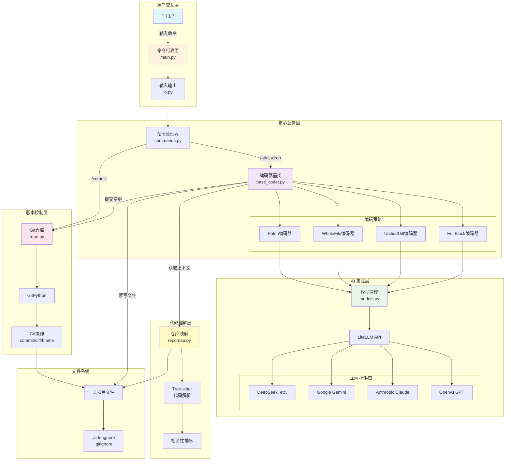
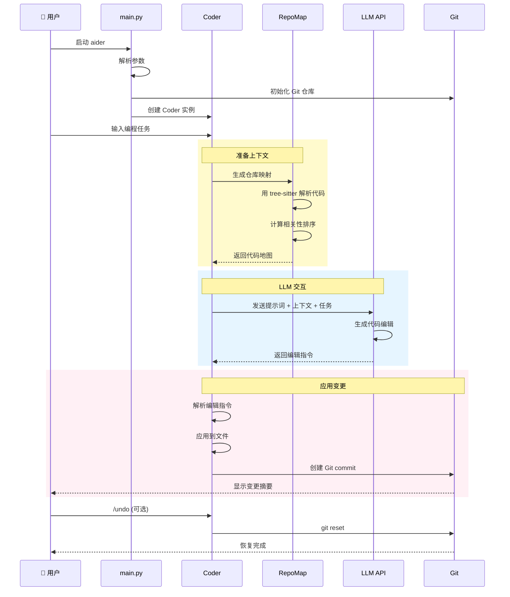
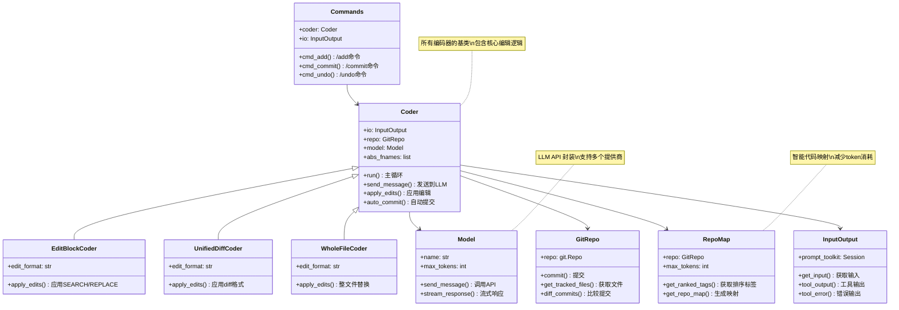
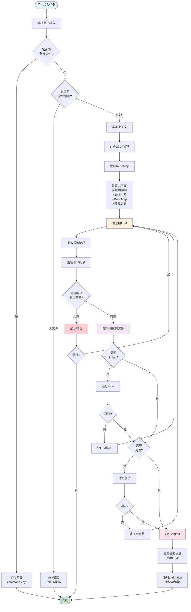
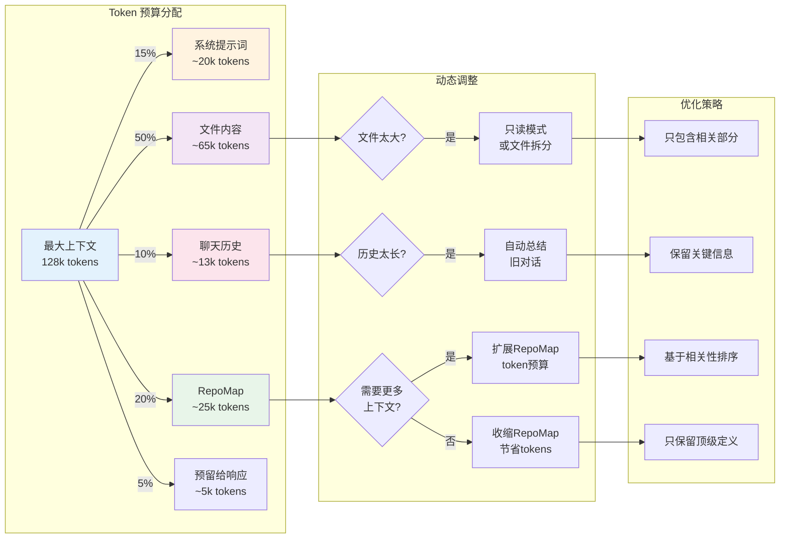
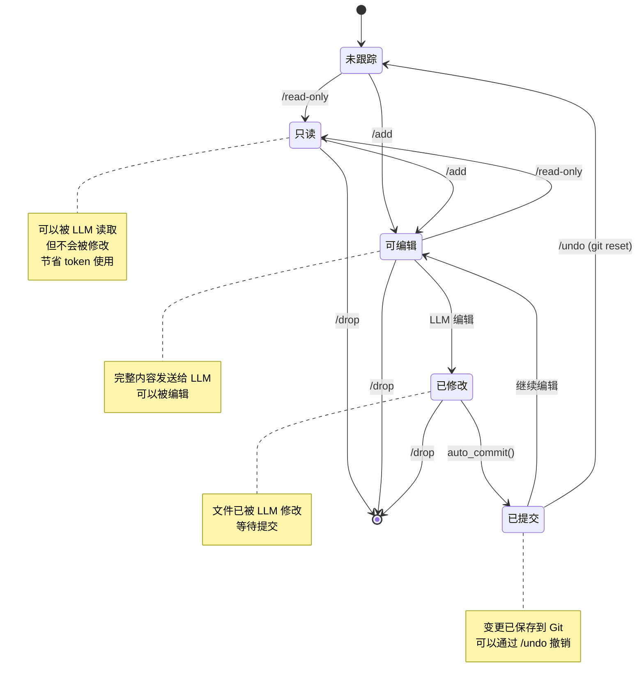
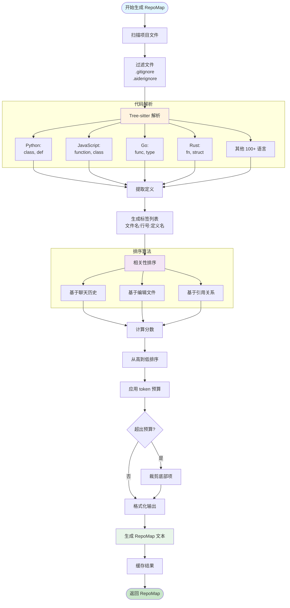

# Aider 项目学习指南

> 欢迎！这份文档专为想要学习和贡献 Aider 项目的初级 Python 程序员准备。

## 目录

1. [项目简介](#项目简介)
2. [为什么学习 Aider？](#为什么学习-aider)
3. [快速开始](#快速开始)
4. [架构可视化](#架构可视化)
5. [项目结构详解](#项目结构详解)
6. [核心概念解析](#核心概念解析)
7. [如何阅读代码](#如何阅读代码)
8. [如何参与贡献](#如何参与贡献)
9. [学习路径建议](#学习路径建议)
10. [常见问题](#常见问题)

---

## 项目简介

### Aider 是什么？

Aider 是一个**AI 配对编程工具**，运行在终端中，让你可以和 LLM（大语言模型）协作来编写和修改代码。

**简单类比**：
- GitHub Copilot = AI 帮你自动补全代码
- ChatGPT = 你问问题，AI 给答案
- **Aider = AI 直接帮你修改项目文件**

### 项目统计

- **开发时长**：18 个月（2023年4月 - 至今）
- **版本数量**：86+ 个版本
- **PyPI 下载**：3.4M+
- **代码行数**：~15,000 行 Python 代码
- **支持语言**：100+ 种编程语言
- **自举程度**：最新版本 88% 的代码由 Aider 自己编写！

### 技术栈

```
核心技术：
├── Python 3.10+          # 主编程语言
├── LiteLLM              # 多 LLM 提供商统一接口
├── GitPython            # Git 操作
├── Tree-sitter          # 代码解析（支持100+语言）
├── Prompt Toolkit       # 终端交互界面
└── Rich                 # 终端美化输出

测试 & 工具：
├── Pytest               # 单元测试
├── Black                # 代码格式化
├── isort                # import 排序
├── Flake8               # 代码检查
└── pre-commit           # Git 钩子
```

---

## 为什么学习 Aider？

### 对初级程序员的价值

1. **真实世界的项目**
   - 不是玩具项目，有 340 万下载量
   - 解决实际问题，有真实用户反馈

2. **代码质量高**
   - 完整的测试覆盖
   - 清晰的代码结构
   - 良好的文档

3. **涉及多个 Python 技术点**
   - 文件 I/O 和编码处理
   - Git 操作自动化
   - API 调用和错误处理
   - 终端 UI 开发
   - 正则表达式和文本解析
   - 面向对象设计

4. **AI 时代的前沿实践**
   - LLM API 集成
   - Prompt 工程
   - 上下文窗口管理
   - 流式响应处理

5. **活跃的社区**
   - 频繁更新
   - 欢迎新贡献者
   - Discord 社区支持

---

## 快速开始

### 环境准备

```bash
# 1. 克隆仓库
git clone https://github.com/Aider-AI/aider.git
cd aider

# 2. 创建虚拟环境（推荐在仓库外）
python3 -m venv ../aider_venv
source ../aider_venv/bin/activate  # macOS/Linux
# 或 Windows: ..\aider_venv\Scripts\activate

# 3. 安装依赖
pip install -e .                              # 安装 aider 本身
pip install -r requirements/requirements-dev.txt  # 安装开发依赖

# 4. 验证安装
aider --version
pytest tests/basic/test_coder.py -v  # 运行一个测试
```

### 第一次运行

```bash
# 方式1：直接运行（需要 API key）
export OPENAI_API_KEY=your-key-here
aider

# 方式2：查看帮助
aider --help

# 方式3：运行测试了解功能
pytest tests/basic/ -v
```

---

## 架构可视化

### 整体架构图



### 数据流程图



### 核心类关系图



### 编辑流程详细图



### Token 管理策略图



### 文件处理流程图



### RepoMap 生成流程图



---

## 项目结构详解

```
aider/
├── aider/                      # 主代码目录
│   ├── __init__.py            # 包初始化
│   ├── main.py                # 入口点 ⭐ 从这里开始阅读
│   ├── io.py                  # 输入输出处理
│   ├── models.py              # LLM 模型管理
│   ├── repo.py                # Git 仓库操作
│   ├── repomap.py             # 代码库映射（重要！）
│   ├── commands.py            # 聊天命令（/add, /commit 等）
│   │
│   ├── coders/                # 不同的编辑策略 ⭐
│   │   ├── base_coder.py     # 核心基类
│   │   ├── editblock_coder.py # SEARCH/REPLACE 格式
│   │   ├── udiff_coder.py    # 统一 diff 格式
│   │   └── wholefile_coder.py # 整文件替换
│   │
│   └── resources/             # 资源文件
│       └── model-metadata.json
│
├── tests/                      # 测试代码
│   ├── basic/                 # 基础功能测试
│   ├── fixtures/              # 测试数据
│   └── ...
│
├── requirements/               # 依赖管理
│   ├── requirements-dev.txt   # 开发依赖
│   └── ...
│
├── scripts/                    # 工具脚本
│   └── pip-compile.sh         # 依赖编译
│
├── pyproject.toml             # 项目配置
├── pytest.ini                 # 测试配置
└── .pre-commit-config.yaml    # Git 钩子配置
```

### 关键文件说明

| 文件 | 作用 | 初学者友好度 |
|------|------|-------------|
| `main.py` | 程序入口，参数解析，初始化流程 | ⭐⭐⭐ 必读 |
| `io.py` | 终端输入输出，颜色，历史记录 | ⭐⭐⭐ 容易理解 |
| `commands.py` | 实现 `/add`, `/commit` 等命令 | ⭐⭐⭐ 推荐阅读 |
| `repo.py` | Git 操作封装 | ⭐⭐ 需要了解 Git |
| `coders/base_coder.py` | 核心编辑逻辑 | ⭐ 较复杂，后期阅读 |
| `repomap.py` | 代码库映射算法 | ⭐ 涉及算法，进阶 |
| `models.py` | LLM API 调用 | ⭐⭐ 需要了解 API |

---

## 核心概念解析

### 1. Coder（编码器）

**概念**：不同的编辑策略，决定如何让 LLM 修改代码。

```python
# 简化示例
class Coder:
    """基类：定义编辑代码的通用流程"""

    def run(self, user_message):
        # 1. 准备上下文（系统提示词 + 代码库映射 + 文件内容）
        context = self.prepare_context()

        # 2. 调用 LLM
        response = self.call_llm(user_message, context)

        # 3. 解析 LLM 的回复
        edits = self.parse_response(response)

        # 4. 应用修改到文件
        self.apply_edits(edits)

        # 5. Git 提交
        self.git_commit()
```

**主要实现**：
- `EditBlockCoder`: SEARCH/REPLACE 块格式
- `UnifiedDiffCoder`: Git diff 格式
- `WholeFileCoder`: 整个文件替换

**为什么有多种？** 不同模型适合不同格式。

### 2. Repo Map（仓库映射）

**问题**：代码库太大，无法全部发给 LLM 怎么办？

**解决方案**：生成一个"地图"，只包含重要的定义。

```python
# 伪代码示例
def generate_repo_map(files, chat_history):
    """
    生成仓库映射

    步骤：
    1. 用 tree-sitter 解析所有文件
    2. 提取函数、类等定义
    3. 根据聊天历史相关性排序
    4. 只保留 token 预算内最相关的部分
    """

    # 1. 解析代码
    definitions = []
    for file in files:
        tree = tree_sitter.parse(file)
        definitions.extend(extract_definitions(tree))

    # 2. 相关性排序
    ranked = rank_by_relevance(definitions, chat_history)

    # 3. 限制 token 数量
    return trim_to_token_budget(ranked, max_tokens=2048)
```

**关键代码**：`repomap.py`

### 3. Git 集成

Aider 会自动为每次 LLM 编辑创建 Git 提交。

```python
# 简化流程
def auto_commit(files_changed, diff, coder):
    """自动提交 LLM 的修改"""

    # 1. 生成提交信息（也用 LLM！）
    commit_msg = generate_commit_message(diff)

    # 2. 添加文件
    git.add(files_changed)

    # 3. 提交（可能修改作者名为 "User (aider)"）
    git.commit(
        message=commit_msg,
        author="Your Name (aider)" if aider_edits else "Your Name"
    )
```

**关键配置**：
- `--attribute-author`: 是否标记 AI 编辑
- `--attribute-co-authored-by`: 添加 co-author 信息

### 4. 上下文窗口管理

**问题**：LLM 有 token 限制（比如 128k tokens）

**解决方案**：
1. **Repo Map** - 只发送相关代码定义
2. **聊天历史总结** - 旧对话自动总结
3. **只读文件** - 不会编辑的文件用较少 token

```python
# 伪代码
def prepare_context(coder):
    tokens_used = 0
    max_tokens = 128000

    # 系统提示词
    context = system_prompt
    tokens_used += count_tokens(system_prompt)

    # 文件内容
    for file in coder.files:
        tokens_used += count_tokens(read_file(file))

    # Repo Map（动态调整大小）
    remaining = max_tokens - tokens_used - 4000  # 留给响应
    repo_map = generate_repo_map(max_tokens=remaining)

    return context
```

---

## 如何阅读代码

### 推荐阅读顺序

#### 第一阶段：理解主流程（1-2天）

1. **`main.py:main()`** (1273行)
   - 从这里开始！
   - 看懂程序启动流程
   - 理解参数解析

2. **`io.py:InputOutput`** (全文)
   - 理解如何读取用户输入
   - 如何美化输出

3. **`commands.py:Commands`** (部分)
   - 阅读简单命令：`cmd_clear()`, `cmd_tokens()`
   - 理解命令模式

#### 第二阶段：深入核心（3-5天）

4. **`coders/base_coder.py:Coder.run()`**
   - 核心运行循环
   - LLM 交互流程

5. **`repo.py:GitRepo.commit()`**
   - Git 提交逻辑
   - 理解 attribution 机制

6. **`models.py:Model`**
   - LLM API 调用
   - 错误处理和重试

#### 第三阶段：高级特性（1周+）

7. **`repomap.py:RepoMap`**
   - 代码解析
   - 相关性排序算法

8. **`coders/editblock_coder.py`**
   - 编辑格式解析
   - 应用修改逻辑

### 阅读技巧

#### 1. 使用调试器

```python
# 在 main.py 中设置断点
def main(argv=None, input=None, output=None):
    import pdb; pdb.set_trace()  # 添加这行

    # 然后运行
    # python -m aider.main --help
```

#### 2. 添加打印语句

```python
# 在关键位置添加
def prepare_context(self):
    print(f"📍 准备上下文，文件数：{len(self.abs_fnames)}")
    print(f"📍 Token 预算：{self.max_tokens}")
    # ... 原代码
```

#### 3. 运行测试理解功能

```bash
# 运行单个测试，查看它在测试什么
pytest tests/basic/test_commands.py::TestCommands::test_cmd_add -v -s

# -v: 详细输出
# -s: 显示 print 语句
```

#### 4. 使用 Aider 自己！

```bash
# 用 Aider 来学习 Aider
aider --read-only aider/main.py

# 然后问问题：
# "解释一下 main() 函数的流程"
# "setup_git() 函数做了什么？"
```

---

## 如何参与贡献

### 贡献类型（从易到难）

#### 🟢 Level 1: 文档和测试（适合新手）

**贡献方式**：
- 改进文档的错别字
- 添加中文文档
- 为现有功能添加测试
- 改进代码注释

**示例 PR**：
```bash
# 1. 找到文档错误
# 2. Fork 仓库
# 3. 修改
git checkout -b fix-typo-in-readme
# 编辑 README.md
git add README.md
git commit -m "docs: fix typo in installation section"
git push origin fix-typo-in-readme
# 4. 提交 PR
```

#### 🟡 Level 2: Bug 修复

**如何开始**：
1. 浏览 [GitHub Issues](https://github.com/Aider-AI/aider/issues)
2. 找标签为 `good first issue` 的问题
3. 复现 bug
4. 修复并提交 PR

**示例流程**：
```bash
# 1. 创建分支
git checkout -b fix-issue-1234

# 2. 写测试（先写测试！）
# 在 tests/basic/test_xxx.py 中添加
def test_bug_1234():
    # 复现 bug 的测试
    assert False  # 暂时失败

# 3. 运行测试（确认失败）
pytest tests/basic/test_xxx.py::test_bug_1234 -v

# 4. 修复 bug
# 修改 aider/xxx.py

# 5. 运行测试（确认通过）
pytest tests/basic/test_xxx.py::test_bug_1234 -v

# 6. 提交
git add .
git commit -m "fix: resolve issue #1234 - brief description"
git push origin fix-issue-1234
```

#### 🔴 Level 3: 新功能

**建议**：
- 先在 Issue 中讨论
- 从小功能开始
- 参考现有代码风格

**新手友好的功能区域**：
- 添加新的 `/` 命令（参考 `commands.py`）
- 支持新的配置选项（参考 `args.py`）
- 改进终端输出格式（参考 `io.py`）

### 代码规范

#### 必须遵守

```python
# ✅ 好的
def calculate_tokens(text):
    """计算文本的 token 数量"""
    if not text:
        return 0
    return len(text) // 4  # 简化计算


# ❌ 不好的（不要用类型注解）
def calculate_tokens(text: str) -> int:
    """计算文本的 token 数量"""
    if not text:
        return 0
    return len(text) // 4
```

#### 提交前检查

```bash
# 1. 运行代码格式化
black aider/
isort aider/

# 2. 运行 linter
flake8 aider/

# 3. 运行相关测试
pytest tests/basic/test_your_changes.py -v

# 4. 提交
git add .
git commit -m "feat: add new feature"
```

### 提交信息规范

使用 [Conventional Commits](https://www.conventionalcommits.org/)：

```
feat: 新功能
fix: Bug 修复
docs: 文档更新
test: 添加测试
refactor: 重构
chore: 杂项（依赖更新等）

示例：
feat: add /export command to save chat history
fix: resolve unicode error in git commit messages
docs: improve installation guide for Windows
test: add test cases for repo map generation
```

---

## 学习路径建议

### 第一周：环境和基础

**目标**：能够运行测试，理解基本流程

- [ ] 搭建开发环境
- [ ] 运行所有测试（`pytest`）
- [ ] 阅读 `main.py` 理解启动流程
- [ ] 阅读 `io.py` 理解输入输出
- [ ] 尝试用 Aider 本身做一个小修改

**练习项目**：
```python
# 在 aider/io.py 中添加一个新的颜色主题
# 1. 找到颜色定义的代码
# 2. 添加一个 --my-theme 选项
# 3. 运行测试确保没破坏现有功能
```

### 第二周：深入核心

**目标**：理解 Coder 的工作原理

- [ ] 阅读 `coders/base_coder.py:run()` 方法
- [ ] 理解 LLM 调用流程（`models.py`）
- [ ] 理解编辑应用逻辑
- [ ] 运行 `test_coder.py` 中的测试

**练习项目**：
```python
# 添加一个简单的 /stats 命令
# 显示当前会话的统计信息：
# - 发送的消息数
# - 编辑的文件数
# - 消耗的 tokens 数
```

### 第三周：Git 和高级特性

**目标**：理解 Git 集成和 Repo Map

- [ ] 阅读 `repo.py` Git 操作逻辑
- [ ] 理解 commit attribution
- [ ] 阅读 `repomap.py` 前半部分
- [ ] 理解 tree-sitter 的作用

**练习项目**：
```python
# 改进提交消息生成
# 1. 在 repo.py 的 get_commit_message() 中
# 2. 添加对 emoji 提交的支持
# 3. 例如: "✨ Add new feature" 而不是 "Add new feature"
```

### 第四周：实战贡献

**目标**：提交你的第一个 PR

- [ ] 浏览 GitHub Issues
- [ ] 找一个 `good first issue`
- [ ] 复现问题
- [ ] 修复并测试
- [ ] 提交 PR

**建议的第一个 PR 类型**：
- 文档改进
- 添加测试覆盖
- 修复小 bug
- 添加新的配置选项

---

## 常见问题

### Q1: 我 Python 基础不好，能学会吗？

**A**: 可以！但建议先补充这些基础：

**必备知识**：
- Python 基础语法（变量、函数、类）
- 文件读写
- 异常处理（try/except）
- 基本的面向对象（类、继承）

**推荐资源**：
- [Python官方教程](https://docs.python.org/3/tutorial/)
- [Real Python](https://realpython.com/)

**学习策略**：
1. 不懂的就查文档
2. 用 Aider 问 Aider（真的有用！）
3. 从简单的 `io.py` 开始，不要一上来就看复杂的

### Q2: 为什么没有类型注解？

**A**: 这是项目的约定，原因：
- 历史原因（项目开始于 2023年初）
- 快速迭代优先
- AI 生成的代码通常不带类型
- 保持风格一致

**你可以**：
- 在自己的练习中使用类型注解
- 但提交 PR 时要移除

### Q3: 测试怎么写？

**A**: 参考现有测试：

```python
# tests/basic/test_my_feature.py
from aider.io import InputOutput

def test_my_new_feature():
    """测试我的新功能"""
    # 1. 准备
    io = InputOutput(pretty=False, yes=True)

    # 2. 执行
    result = io.my_new_method()

    # 3. 断言
    assert result == expected_value
```

**运行测试**：
```bash
# 运行单个测试
pytest tests/basic/test_my_feature.py::test_my_new_feature -v

# 运行整个文件
pytest tests/basic/test_my_feature.py -v

# 运行所有测试
pytest
```

### Q4: 我应该从哪里开始贡献？

**A**: 推荐顺序：

1. **文档** - 最简单
   - 修正错别字
   - 改进说明
   - 添加示例

2. **测试** - 熟悉代码
   - 为现有功能添加测试
   - 提高测试覆盖率

3. **Bug 修复** - 有意义
   - 找 `good first issue`
   - 修复小 bug

4. **新功能** - 最有挑战
   - 先讨论再动手
   - 从小功能开始

### Q5: pre-commit 钩子失败怎么办？

**A**: 自动修复：

```bash
# pre-commit 会自动运行 black 和 isort
# 如果失败，它们会自动格式化代码
# 你只需要重新 add 和 commit：

git add .
git commit -m "your message"
# 如果失败：
git add .  # 再次添加自动修复的文件
git commit -m "your message"
```

### Q6: 如何调试 Aider？

**A**: 多种方式：

```bash
# 方式1：运行时加 --verbose
aider --verbose

# 方式2：Python 调试器
python -m pdb -m aider.main

# 方式3：在代码中加断点
import pdb; pdb.set_trace()

# 方式4：打印调试
print(f"🐛 DEBUG: {variable}")
```

### Q7: 我改了代码，如何测试？

**A**: 完整测试流程：

```bash
# 1. 安装为可编辑模式（只需一次）
pip install -e .

# 2. 修改代码
# 编辑 aider/xxx.py

# 3. 运行相关测试
pytest tests/basic/test_xxx.py -v

# 4. 手动测试
aider --help

# 5. 运行所有测试（提交 PR 前）
pytest
```

---

## 额外资源

### 官方文档
- [Aider 官网](https://aider.chat/)
- [安装指南](https://aider.chat/docs/install.html)
- [使用文档](https://aider.chat/docs/usage.html)
- [贡献指南](https://github.com/Aider-AI/aider/blob/main/CONTRIBUTING.md)

### 社区
- [GitHub Issues](https://github.com/Aider-AI/aider/issues)
- [Discord 社区](https://discord.gg/Y7X7bhMQFV)

### 相关技术
- [LiteLLM 文档](https://docs.litellm.ai/)
- [Tree-sitter 文档](https://tree-sitter.github.io/tree-sitter/)
- [GitPython 文档](https://gitpython.readthedocs.io/)
- [Prompt Toolkit 文档](https://python-prompt-toolkit.readthedocs.io/)

---

## 最后的建议

### ✅ Do（推荐做）

- **从小处开始** - 不要试图一次理解所有代码
- **多问问题** - Discord 社区很友好
- **多写测试** - 这是学习代码的最好方式
- **用 Aider 学 Aider** - 真的有用！
- **记录你的学习** - 写博客、做笔记

### ❌ Don't（不推荐）

- **不要跳过测试** - 没测试的代码不要提交
- **不要直接改复杂功能** - 先从简单的开始
- **不要害怕犯错** - PR 可以修改，代码可以重写
- **不要急于求成** - 慢慢来比较快

---

## 你的学习计划

建议你在这里写下自己的计划：

```
Week 1 目标：
- [ ] 搭建环境
- [ ] 运行测试
- [ ] 阅读 main.py

Week 2 目标：
- [ ] 理解 Coder 流程
- [ ] 完成一个练习项目

Week 3 目标：
- [ ] 理解 Git 集成
- [ ] 阅读 repomap.py

Week 4 目标：
- [ ] 提交第一个 PR
```

---

## 结语

欢迎来到 Aider 社区！这是一个年轻、活跃、充满创新的项目。作为初级程序员，这里有很多学习和成长的机会。

**记住**：
- 每个专家都曾是初学者
- 代码是写出来的，不是想出来的
- 社区在这里帮助你

祝你学习愉快！🚀

---

*最后更新：2025年10月*
*维护者：社区贡献*
*欢迎改进这份文档！*
